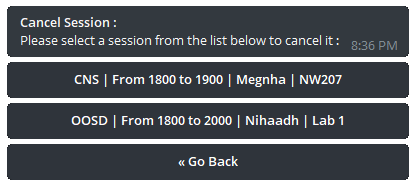

# Schedule Bot Mark IV

There will be only a single bot controlling this entire project. The bot will recieve commands from the end user such as `/today`. The bot will
also have a command that will not be listed in the command line interface. and that command is `/admin`. If used without any paramenters the
bot will start using the inline keyboad to interact with the user. This will be useful for when the admin is not comfortable with manually entering
commands.

## Installing the bot
### Node-Red Setup

Yes, you'll need node red for this. Also you'll need to install the following nodes, You dont have to install the EXACT same versions.

```
npm install node-red-contrib-chatbot
npm install node-red-contrib-python3-function
npm install node-red-contrib-pythonshell
npm install node-red-contrib-telegrambot
npm install node-red-contrib-telegrambot-home
npm install node-red-node-email
npm install node-red-node-feedparser
npm install node-red-node-rbe
npm install node-red-node-sentiment
npm install node-red-node-tail 
npm install node-red-node-twitter
```

Then you'll need to import the following node configuration:

```json
[{"id":"32002f64.828618","type":"tab","label":"Telegram Schedule Bot (TESTING)","disabled":false,"info":""},{"id":"bbc79e48.4ce02","type":"telegram receiver","z":"32002f64.828618","name":"","bot":"c125d188.a3af18","saveDataDir":"","x":95,"y":276,"wires":[["3229d1cf.98e61e"],[]]},{"id":"fe9550f4.fcddd8","type":"pythonshell in","z":"32002f64.828618","name":"Main Processing Function","pyfile":"O:\\GitHub\\schedule_bot_mark_IV\\test_run.py","virtualenv":"","continuous":false,"stdInData":false,"x":1423.9000244140625,"y":290,"wires":[["9183db4f.0bfd1"]]},{"id":"a2371f9.da483e","type":"catch","z":"32002f64.828618","name":"","scope":null,"uncaught":false,"x":1472.5,"y":378.5999755859375,"wires":[["9183db4f.0bfd1"]]},{"id":"261ed448.d3e5b4","type":"pythonshell in","z":"32002f64.828618","name":"Adminsitrative Functions","pyfile":"O:\\GitHub\\schedule_bot_mark_IV\\admin_functions.py","virtualenv":"","continuous":false,"stdInData":false,"x":1425.5,"y":334.4000244140625,"wires":[["9183db4f.0bfd1"]]},{"id":"4eb8821d.5788e4","type":"json","z":"32002f64.828618","name":"Convert to string","property":"payload","action":"str","pretty":false,"x":1169.5,"y":333.4000244140625,"wires":[["261ed448.d3e5b4"]]},{"id":"d7289206.60aa48","type":"telegram event","z":"32002f64.828618","name":"Keyboard_Stuff","bot":"c125d188.a3af18","event":"callback_query","autoanswer":false,"x":85,"y":383.60003662109375,"wires":[["2642cf9b.6ee4f"]]},{"id":"9183db4f.0bfd1","type":"debug","z":"32002f64.828618","name":"Final Debugging","active":true,"tosidebar":true,"console":true,"tostatus":true,"complete":"true","targetType":"full","x":1764.5,"y":294.79998779296875,"wires":[]},{"id":"c431903f.a8749","type":"telegram command","z":"32002f64.828618","name":"/admin handler","command":"/admin","bot":"c125d188.a3af18","strict":false,"x":85,"y":329.5999755859375,"wires":[["2642cf9b.6ee4f"],[]]},{"id":"f170c9f7.41de98","type":"pythonshell in","z":"32002f64.828618","name":"Administrative Respond functions","pyfile":"O:\\GitHub\\schedule_bot_mark_IV\\admin_respond_functions.py","virtualenv":"","continuous":false,"stdInData":false,"x":1454.5,"y":248.20001220703125,"wires":[["9183db4f.0bfd1"]]},{"id":"3229d1cf.98e61e","type":"pythonshell in","z":"32002f64.828618","name":"Check if Awaiting Data","pyfile":"O:\\GitHub\\schedule_bot_mark_IV\\manipulate_payload.py","virtualenv":"","continuous":false,"stdInData":false,"x":408.5,"y":297,"wires":[["8a253e39.2bb5c8"]]},{"id":"1446f66e.7bae72","type":"switch","z":"32002f64.828618","name":"Switch if awaiting data","property":"payload.awaiting_data","propertyType":"msg","rules":[{"t":"true"},{"t":"false"}],"checkall":"true","repair":false,"outputs":2,"x":874.2000732421875,"y":264,"wires":[["1cd6bc7b.b365ac"],["3dc685ae.ecd012"]]},{"id":"2642cf9b.6ee4f","type":"pythonshell in","z":"32002f64.828618","name":"Check if Awaiting Data","pyfile":"O:\\GitHub\\schedule_bot_mark_IV\\manipulate_payload.py","virtualenv":"","continuous":false,"stdInData":false,"x":408.20001220703125,"y":337.20001220703125,"wires":[["a4199e6.6b948e"]]},{"id":"3dc685ae.ecd012","type":"json","z":"32002f64.828618","name":"Convert to string","property":"payload","action":"str","pretty":false,"x":1165,"y":291,"wires":[["fe9550f4.fcddd8"]]},{"id":"8a253e39.2bb5c8","type":"json","z":"32002f64.828618","name":"Convert to Object","property":"payload","action":"obj","pretty":false,"x":645,"y":277,"wires":[["1446f66e.7bae72"]]},{"id":"1cd6bc7b.b365ac","type":"json","z":"32002f64.828618","name":"Convert to string","property":"payload","action":"str","pretty":false,"x":1166,"y":252,"wires":[["f170c9f7.41de98"]]},{"id":"69b77233.d12264","type":"switch","z":"32002f64.828618","name":"Switch if awaiting data","property":"payload.awaiting_data","propertyType":"msg","rules":[{"t":"true"},{"t":"false"}],"checkall":"true","repair":false,"outputs":2,"x":875,"y":336,"wires":[[],["4eb8821d.5788e4"]]},{"id":"a4199e6.6b948e","type":"json","z":"32002f64.828618","name":"Convert to Object","property":"payload","action":"obj","pretty":false,"x":649.7999267578125,"y":339,"wires":[["69b77233.d12264"]]},{"id":"c125d188.a3af18","type":"telegram bot","z":"","botname":"FRIDAY","usernames":"","chatids":"","baseapiurl":"","updatemode":"polling","pollinterval":"1","usesocks":false,"sockshost":"","socksport":"6667","socksusername":"anonymous","sockspassword":"","bothost":"","localbotport":"8443","publicbotport":"8443","privatekey":"","certificate":"","useselfsignedcertificate":false,"verboselogging":false}]
```

## Using the bot

### Interactive Mode

When the admin starts using the `/admin` function without any parameters the interactive mode is started. When the buttons of the keyboard redirect user to another keyboard or message the current keyboard will delete itself before or after executing its designated task. Hence the suicide keyboards. You can disable the interactive mode by clicking on the button that says disable interactive mode or send the command `/admin disable_interactive`. This will disable the suicide keyboards and you'll have to use manual command like commands. To bring back interactive mode just send `/admin` again. Like so : 

<p align="center">

</p>

There are some functions that interactive mode cannot work with ( for now ). And those functions include all functions that require additional parameters that the bot cannot predict. Such as appending sessions and blasting out messages. Other functions such as cancel sessions, which the bot can suggest options via the keyboard.
 
---

## Configuring Long Term Sessions
To make long term changes. The `session_list.json` file'd be modifed. The session file below is a blank template. You can any amount of sessions to each day.
```json { 
"days" :
	{ 
		"sunday" :  {
			"sessions" : []
		},
		"monday" :  {
			"sessions" : []
		},
		"tuesday" : {
			"sessions" : []
		},
		"wednesday" : {
			"sessions" : []
		},
		"thursday" :  {
			"sessions" : []
		},
		"friday" : {
			"sessions" : []
		},
		"saturday" : {
			"sessions" : []
		}
	}
}
```
To add a session append the following code to the `sessions` array of the session's respective day :
```json
["SESSION_NAME", "STARTING_TIME", "ENDING_TIME", "BRING_LAPTOP_BOOLEAN", "LECTURER_NAME", "VENUE"]
```

For example, an OOSD session to monday at 1800 hours to 1900 hours will look like this :
```json { 
"days" :
	{ 
		"sunday" :  {
			"sessions" : []
		},
		"monday" :  {
			"sessions" : []
		},
		"tuesday" : {
			"sessions" : []
		},
		"wednesday" : {
			"sessions" : []
		},
		"thursday" :  {
			"sessions" : []
		},
		"friday" : {
			"sessions" : []
		},
		"saturday" : {
			"sessions" : ["OOSD", "1800", "1900", "True", "Mr.Potatoe", "Lab 1"]
		}
	}
}
```
### Note

The start and end time have to be in 24-hour format. Or else it will mess up the arthimetic functions in the code. If you want the time in 12-hour format, convert the 24-hour format to 12-hour format <u><b>AFTER</b></u> the arthimetic functions in `parse_natural_language.py`. Use the following block of code to convert 24-hour format to 12-hour format:

```python
from datetime import datetime
# make sure the 12-hour format is a datetime object and not a string
d = datetime.strptime("10:30", "%H:%M")
d.strftime("%I:%M %p")
d = datetime.strptime("22:30", "%H:%M")
d.strftime("%I:%M %p")
```


 
---

## Appending and Cancelling sessions
To make short term modifications to the sesssions you'd have to update the `appended_session_list.json` file. The `appended_session_list.json` file will be reset at the end of every week. To check if sessions are cancelled aligned array checking is used. 

for example : when the `appended_session_list` is set to the following : 
```json
{
	"cancelled" : {
		"sunday" : [],
		"monday" : [],
		"tuesday" : [],
		"wednesday" : [],
		"thursday" : [],
		"friday" : [],
		"saturaday" : []
	},
	"appended" : {
		"sunday" : [],
		"monday" : [],
		"tuesday" : [],
		"wednesday" : [],
		"thursday" : [],
		"friday" : [],
		"saturaday" : []
	}
}

```
the output will be the following
``` ['You have 2 session(s) today. They are the following : ', 'You have OOSD from 1800 hours to 2000 hours with Nihaadh. Class will be held at Lab 1.', 'You have CNS from 2000 hours to 2200 hours with Megnha. Class will be held at NW207.', "You won't be needing your laptop"]```

and the following `appended_session_list` will give the following output:

```json {
	"cancelled" : {
		"sunday" : [],
		"monday" : [],
		"tuesday" : [],
		"wednesday" : [],
		"thursday" : [],
		"friday" : [],
		"saturaday" : []
	},
	"appended" : {
		"sunday" : [],
		"monday" : [],
		"tuesday" : [],
		"wednesday" : [],
		"thursday" : [],
		"friday" : [["OOSD", "1800", "2000", "True", "Java", "Lab1", "False"]],
		"saturaday" : []
	}
}

```
```['You have 1 session(s) today. They are the following : ', 'Your OOSD session have been cancelled', 'You have CNS from 2000 hours to 2200 hours with Megnha. Class will be held at NW207.', 'In addition to your regular classes you also have the following appended class(es) :', 'OOSD from 1800 hours to 2000 hours with Java, at Lab1.', "You won't be needing your laptop"```

### Appending and Cancelling Session Via Interactive Mode
You can append and cancel sessions from the interactive mode. You have to click on `Manipulate Sessions`. When you do so you'll be presented with the following keyboard.

<p align="center">
	
</p>

Now to cancel a session click on `cancel session`. From here you'll be presented with the following keyboard: 

<p align="center">
	
</p>

Now click on a day and you'll presented with a list of sessions available on that day. Click on a session to cancel it. You can revert the affects of a cancelled session via the `Revert Cancelled` button. Anyway here is a keyboard that will be presented to you when you choose a day : 

<p align="center">
	
</p>

---

### Note
All of the above examples are made with the `appended_session_list.json` set to the following configuration:

```json { 
"days" :
	{ 
		"sunday" :  {
			"sessions" : [
				["CNS","2000","2200","True","Mr.Krishnamoorthy","Computer Lab 2","True"]
			]
		},
		"monday" :  {
			"sessions" : []
		},
		"tuesday" : {
			"sessions" : ["Introduction to Artificial Intelligence", "1800", "2100", "Computer Lab 2", "False"]
		},
		"wednesday" : {
			"sessions" : ["OOSD" , "1900", "2200", "Computer Lab 2", "False"]
		},
		"thursday" :  {
			"sessions" : [
				["CNS", "1800", "1900", "False", "Megnha", "NW207", "False"],
				["OOSD", "1800", "2000", "True", "Nihaadh", "Lab 1", "False"]
			]
		},
		"friday" : {
			"sessions" : [
				["CNS", "1800", "1900", "False", "Megnha", "NW207", "False"],
				["OOSD", "1800", "2000", "True", "Nihaadh", "Lab 1", "False"]
			]
		},
		"saturday" : {
			"sessions" : []
		}
	}
}
```

## Additional Notes
When using to send message use the `parse_natural_language.py` file like the following:
```python
import parse_natural_language as parse_nl
print(parse_nl.getFullTodayNL())
```
